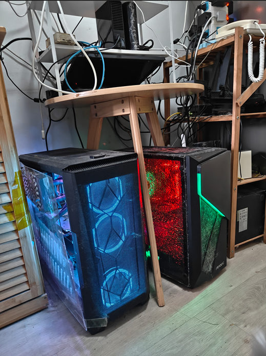

## Welcome to RapidAI Research Institute (RapidAI Research)

The RapidAI Research Institute is an academic institution under the RapidAI open-source organization. In Chinese, it is called 捷智技术研究院.

[Visit Chinese Version](index.md)     [Paper List](paperlist.md)

## Latest News

- Latest accepted papers by RapidAI Research.

### Papers published by the researchers of this institute will have their second affiliation labeled as RapidAI Research. For all 7-level associate researchers or higher-ranking members, a permanent email service with the suffix @rapidai.tech is provided for long-term academic communication with peers.

The image below is an archival picture of the initial IDC center of our institute:

#### IDC Configuration
1000M internet access, dual GPUs (4090 & 6000 ADA), 50TB storage space.

### Management Team (members pending until formal establishment of the institute)
- Honorary Dean: (Professor of Peking University, Yangtze River Scholar)
- Executive Dean: Ma Yong (znsoft)
- Chief Scientist: Pending
- Engineering Director: Wang JiaHua

### Academic Committee

## Member Rules
1. Students of Danny Bo's academic institutions automatically become junior researchers of the institute.
2. Master's and Ph.D. students in the China Outstanding Engineer Program automatically become junior researchers.
3. Graduate students from Beijing Institute of Technology/BUPT guided by mentors in this institute will automatically become junior researchers.
4. After completing one paper in a top-tier journal or in a top conference, you will be promoted to a level-7 associate researcher. Upon completing two papers before graduating with a master’s degree, you will be promoted to a level-6 associate researcher. After earning your Ph.D., you will be promoted to a level-5 associate researcher.
